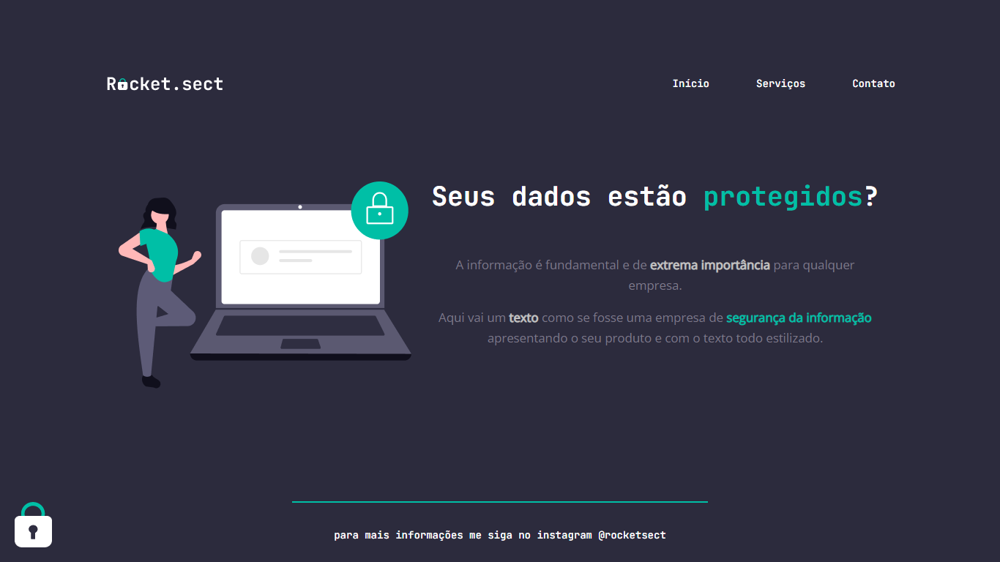

# Desafio - Recriando layout

Este projeto é um desafio da trilha Explorer, turma 8, da Rocketseat.

O objetivo deste desafio é treinar o uso das linguagens HTML5 e CSS3 aprendidas no Stage 2, reconstruindo uma aplicação do zero a partir de um layout criado pela equipe da Rocketseat.

## Conhecimentos Aplicados

Neste desafio utilizei variáveis no CSS para cores e tipografia de fonte. Em CSS também utilizei o seletor * para padronizar em todas as tags do html os valores dos atibutos padding, margin e box-sizing, este com valor border-box, que pertence ao conceito box-model. Outro conceito utilizado foi flex-box. Assim consegui deixar elementos lado a lado.

Acesse o site clicando [aqui](https://jamisonmmartins.github.io/rocket.sect/).

## Tecnologias Utilizadas
 

## Screenshots

